# 🎬 Full-Stack Developer Coding Challenge: Movie Ticket Booking System


## Overview

This project is a full-stack movie ticket booking system designed to demonstrate modern backend architecture and API development practices.

The system supports authentication, role-based authorization, movie management, seat reservation, ticket generation, file storage, and Redis-backed session management.

The project was built to showcase:

- RESTful API Design
- Authentication & Authorization
- Redis Caching
- Object Storage Integration
- PDF Generation
- Dockerized Deployment
- Logging & Monitoring

## Features

### Authentication & Authorization

- Secure JWT Authentication (Register / Login)
- Role-Based Access Control (RBAC) for protected APIs
- Access Token Management with Redis Cache for improved performance and scalability

### User Management

- Create, Retrieve, Update User Profiles
- Profile Image Upload and Management

### Movie Management

- Full CRUD Operations for Movies
- Movie Detail Retrieval
- Movie Poster Upload and Storage

### File Storage Service

- Object Storage Integration with MinIO
- Upload, Retrieve, and Delete Files
- Support for Movie Posters and User Profile Images

### Ticket Booking System

- Movie Ticket Booking
- Ticket Detail and Booking History Retrieval
- PDF Ticket Generation and Export

### Infrastructure & Performance

- Redis Caching for Session and Token Management
- RESTful API Architecture
- Dockerized Development & Deployment Environment

### Security

- JWT-Based Authentication
- Protected Routes with Authorization Guards
- Role-Based API Access Control
- Environment Variable Configuration for Sensitive Data

### Log Management

- Centralized Application Logging with Winston
- Structured Logging for API Requests and System Events
- Error Tracking and Exception Logging
- Request and Response Monitoring
- Log Level Management (Info, Warning, Error, Debug)
- Timestamped Logs for Troubleshooting and Auditing

## Seat Reservation Strategy

To prevent double booking:

1. User selects seats.
2. Seats are marked as `held`.
3. A temporary reservation is created.
4. Hold information is stored with expiration time.
5. If payment/confirmation is not completed before expiration:
   - Hold is released

   - Seats become available again.

6. Confirmed bookings change seat status to `booked`.

## Authentication Flow

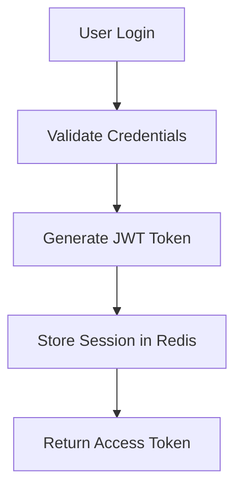

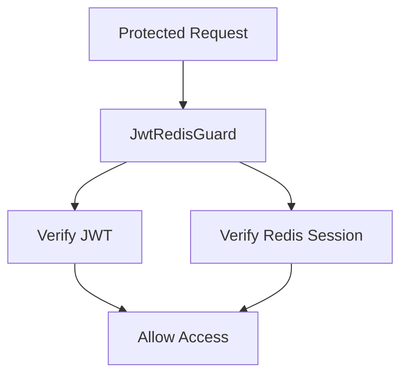

## API Statistics

- 20+ REST Endpoints
- JWT Protected APIs
- Role-Based Endpoints
- Swagger Documentation
- File Upload APIs
- PDF Export APIs

## Environment Variables

| Variable         | Description        |
| ---------------- | ------------------ |
| PORT             | Application Port   |
| MONGO_URI        | MongoDB Connection |
| REDIS_HOST       | Redis Host         |
| REDIS_PORT       | Redis Port         |
| JWT_SECRET       | JWT Secret         |
| MINIO_ENDPOINT   | MinIO Endpoint     |
| MINIO_ACCESS_KEY | MinIO Access Key   |
| MINIO_SECRET_KEY | MinIO Secret Key   |

## Tech Stack

- NestJS
- Express
- NodeJS
- TypeScript
- Swagger
- qrcode
- Winston
- PDF-LIB
- MongoDB
- Redis
- Minio
- Docker

## Architecture Diagram

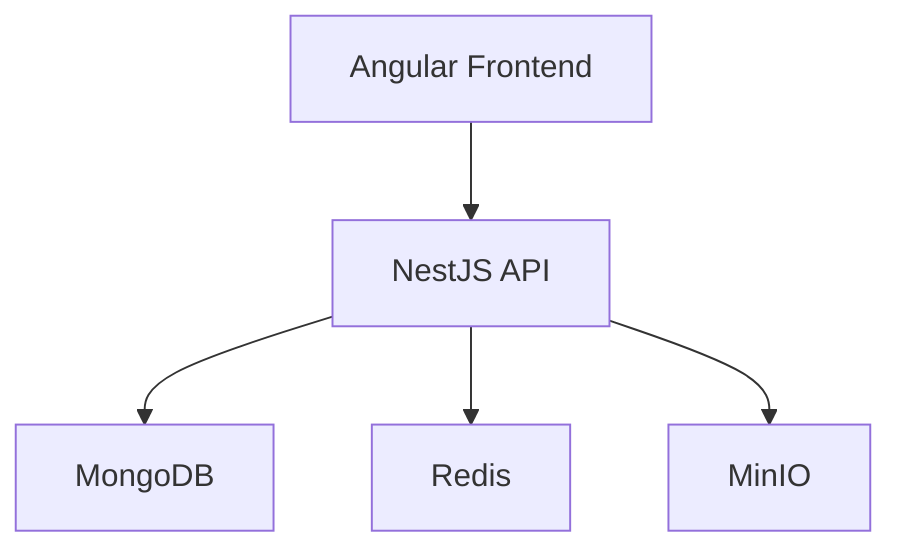

## Backend Flow Diagram ⭐

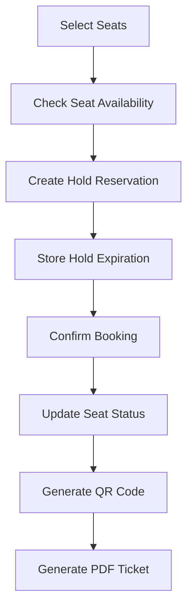

## Project Structure

```text
├── src/
│    ├── auth/
│    │    ├── auth.controller.ts
│    │    ├── auth.module.ts
│    │    ├── auth.service.ts
│    │    ├── RedisProvider.ts
│    │    └── session-cleanup.service.ts
│    ├── booking/
│    │    ├── booking.controller.ts
│    │    ├── booking.module.ts
│    │    ├── booking.schema.ts
│    │    ├── booking.service.ts
│    │    └── pdf.service.ts
│    ├── guard/
│    │    ├── jwt-redis.guard.ts
│    │    ├── role.decorator.ts
│    │    └── role.guard.ts
│    ├── minio/
│    │    ├── minio.module.ts
│    │    └── minio.service.ts
│    ├── movies/
│    │    ├── movies.schema.ts
│    │    ├── movies.controller.ts
│    │    ├── movies.module.ts
│    │    ├── movies.service.ts
│    │    ├── screening.schema.ts
│    │    └── seat.schema.ts
│    ├── storage/
│    │    ├── storage.module.ts
│    │    ├── storage.service.ts
│    │    ├── storage.schema.ts
│    │    └── storage.schema.ts
│    ├── users/
│    │    ├── users.module.ts
│    │    ├── users.service.ts
│    │    ├── users.schema.ts
│    │    └── users.schema.ts
│    ├── app.controller.ts
│    ├── app.module.ts
│    ├── app.service.ts
│    └── main.ts
├── .env
├── Dockerfile
└── docker-compose.yml

```

## Database Design

### Booking

| Field       | Type                           |
| ----------- | ------------------------------ |
| screeningId | ObjectId                       |
| room        | string                         |
| startsAt    | Date                           |
| movieId     | ObjectId                       |
| userId      | ObjectId                       |
| status      | held \| confirmed \| cancelled |
| holdId      | ObjectId                       |
| expiresAt   | Date                           |

#### Seats Structure

```ts
{
  seatId: string
  seatRef: ObjectId
}
```

### Movies

| Field       | Type           |
| ----------- | -------------- |
| name        | string         |
| type        | string         |
| description | string         |
| length      | number         |
| poster      | string         |
| startDate   | Date           |
| endDate     | Date           |
| rooms       | Array\<string> |

### Screening

| Field    | Type     |
| -------- | -------- |
| movieId  | ObjectId |
| startsAt | Date     |
| room     | string   |
| capacity | number   |

### Seats

| Field         | Type                              |
| ------------- | --------------------------------- |
| screeningId   | ObjectId                          |
| seatId        | ObjectId                          |
| row           | string                            |
| number        | number                            |
| status        | 'available' \| 'held' \| 'booked' |
| holdId        | ObjectId                          |
| holdExpiresAt | Date                              |
| bookingId     | ObjectId                          |
| bookingUser   | ObjectId                          |

### Storage

| Field        | Type    |
| ------------ | ------- |
| filename     | string  |
| originalName | string  |
| mimeType     | string  |
| size         | number  |
| isPublic     | boolean |
| url          | string  |

### User

| Field    | Type          |
| -------- | ------------- |
| username | string        |
| email    | string        |
| password | hashed string |
| role     | string        |
| imageUrl | string        |

## API Documentation Preview

Swagger UI available at:
http://localhost:8000/docs#/

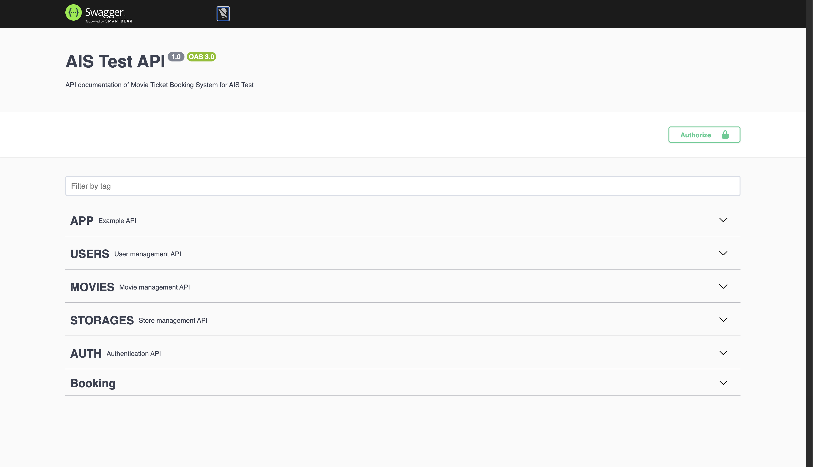

## Security Features

- JWT Access Token Authentication
- Password Hashing with bcrypt
- Role-Based Authorization (RBAC)
- Protected Routes with Guards
- Redis Session Validation
- Environment Variable Management

## Technical Challenges

### Challenge 1: Token Revocation

<b>
Problem:
</b>
JWT is stateless and cannot be revoked easily.

<b>
Solution:
</b>
Store active tokens in Redis and validate every request through a custom JwtRedisGuard.

---

### Challenge 2: File Storage

<b>
Problem:
</b>
Movie posters and profile images should not be stored inside MongoDB.

<b>
Solution:
</b>
Use MinIO Object Storage and persist only file metadata in MongoDB.

---

### Challenge 3: Ticket Export

<b>
Problem:
</b>
Users need printable movie tickets.

<b>
Solution:
</b>
Generate PDF tickets dynamically using pdf-lib and embed QR Codes for validation.

## Quick Start ⭐⭐⭐

### Clone Repository

```bash

git clone https://github.com/codeBrewer216/AIS-test-BE.git

```

### Environment Setup

Create a `.env` file from the example configuration:

```bash
cp .env.example .env
```

Update the environment variables inside `.env` before running the application.

### Start Services

```bash
docker compose up -d
```

### Install Dependencies

```bash
npm install
```

### Run Application

```bash
npm run start:dev
```

### Swagger

```
http://localhost:8000/docs
```

## Deployment

The application is fully containerized using Docker.

Services:

- NestJS API
- MongoDB
- Redis
- MinIO

Deployment can be started using:

```bash
docker compose up -d
```

---

## Logging

Example Log Output

```json
{
  "timestamp": "2026-06-24 08:30:12",
  "level": "info",
  "message": "User login successful",
  "userId": "685a1c..."
}
```

---

## Main API Endpoints

### User APIs

| Method | Endpoint                | Description                 |
| ------ | ----------------------- | --------------------------- |
| POST   | /users                  | Create user                 |
| GET    | /users                  | Show users                  |
| GET    | /users/:id              | Show user                   |
| POST   | /users/:id/role         | Change role of user         |
| POST   | /users/:id/image        | Add user's image profile    |
| POST   | /users/:id/image/remove | Remove user's image profile |

### Movies APIs

| Method | Endpoint              | Description       |
| ------ | --------------------- | ----------------- |
| POST   | /movies               | Create movie      |
| GET    | /movies               | Show movies       |
| GET    | /movies/:id           | Show movie        |
| PUT    | /movies/:id           | Edit movie        |
| DELETE | /movies/:id           | Delete movie      |
| GET    | /movies/:id/showtimes | show movie detail |

### Storage APIs

| Method | Endpoint                | Description    |
| ------ | ----------------------- | -------------- |
| POST   | /storage/upload         | Upload File    |
| GET    | /storage/file/:filename | Show file date |
| DELETE | /storage/:filename      | delete file    |

### Authentication APIs

| Method | Endpoint      | Description          |
| ------ | ------------- | -------------------- |
| POST   | /auth/login   | Login                |
| GET    | /auth/me      | Get profile data     |
| POST   | /auth/logout  | Logout               |
| POST   | /auth/refresh | Refresh access token |

### Booking APIs

| Method | Endpoint                | Description                  |
| ------ | ----------------------- | ---------------------------- |
| POST   | /booking                | Reserve movie booking        |
| GET    | /booking/user           | Show booking history of user |
| GET    | /booking/:id            | show booking data            |
| GET    | /booking/:id/export-pdf | Export Ticket as PDF File    |

## Project Metrics

- 20+ REST API Endpoints
- 5 Core Modules
- JWT + Redis Session Validation
- PDF Ticket Generation
- QR Code Integration
- Object Storage with MinIO
- Dockerized Multi-Service Environment

## Performance Considerations

- Redis is used to reduce database lookups during authentication.
- MinIO stores binary files outside MongoDB.
- Seat reservation uses temporary holds to prevent double booking.
- JWT validation is combined with Redis session verification.
- Winston logging supports application monitoring and troubleshooting.

## Architecture Decisions

### Why Redis?

Redis is used to store active user sessions and support token revocation.

### Why MinIO?

MinIO provides S3-compatible object storage and keeps binary files outside MongoDB.

### Why MongoDB?

MongoDB allows flexible schema design for movies, screenings, seats, and bookings.

### Why Winston?

Winston provides centralized logging and structured log management for troubleshooting and auditing.

## Future Improvements

- Refresh Token Rotation
- Rate Limiting
- Unit Testing (Jest)
- E2E Testing
- CI/CD Pipeline (GitHub Actions)
- Kubernetes Deployment
- Uptime Kuma Monitoring

## Snapshot

### Homepage (Not Login Yet)


### Homepage (Already Login )

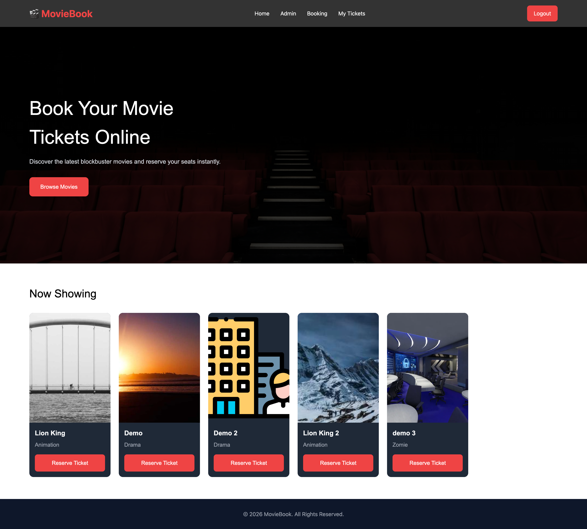

### Admin


#### Add Movie

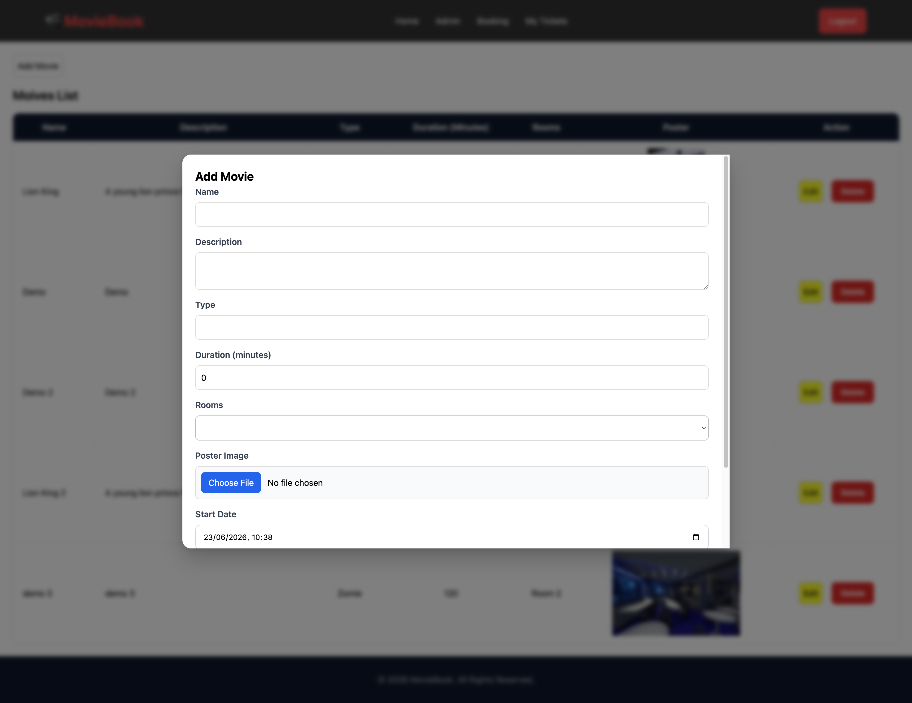

#### Edit Movie

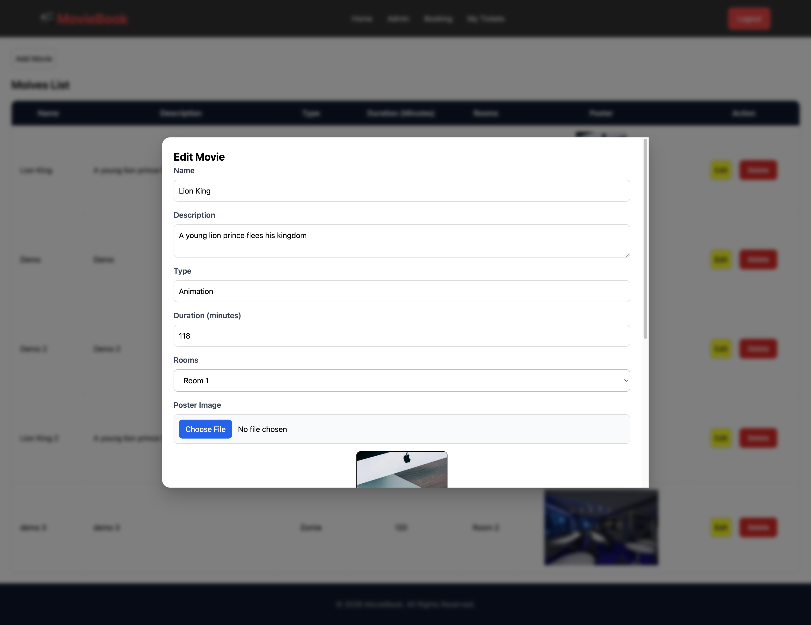
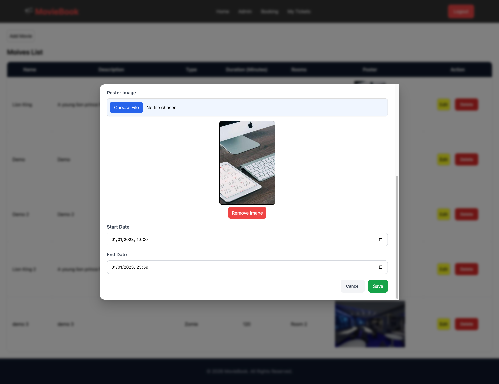

#### Delete Movie

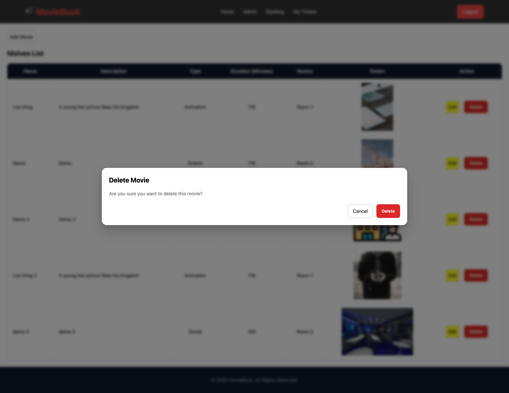

### Booking

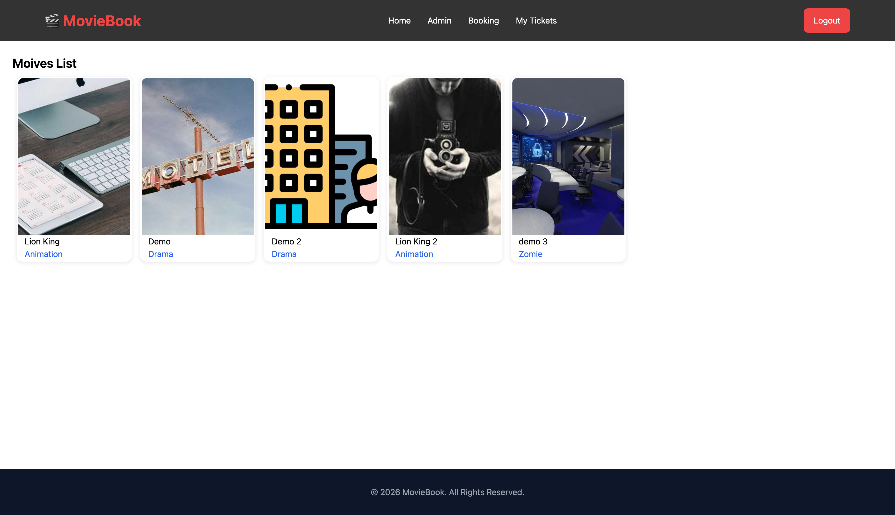

#### Select Movie


#### Select Showtime

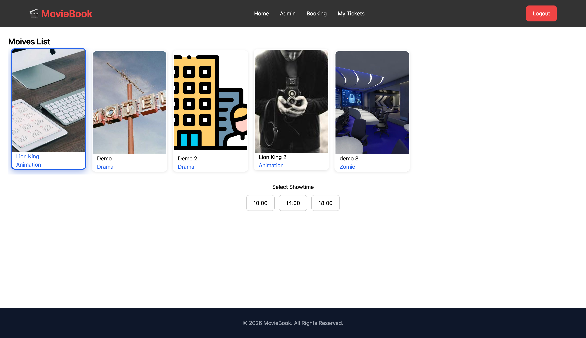

#### Select Seats


#### Confirm Reservation


#### Already Booked


### Ticket

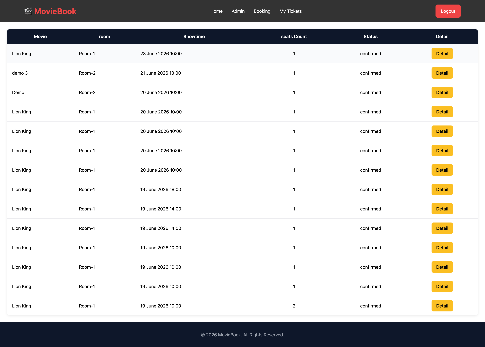

#### Detail

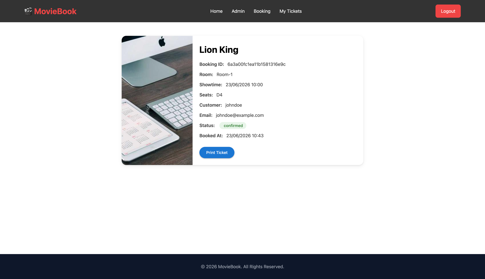

#### Ticket

[📄 View Ticket PDF](public/pdf/ac5f85c0-7f1c-4357-95c8-5c79eb9c909a.pdf)

## Demo

[📄 Demo Video](hhttps://youtu.be/uVwU33R7AiI)

## License

MIT License

## Author

**Pongsapuk Sawaroj**
Full-Stack Developer

- GitHub: https://github.com/codeBrewer216
- Email: pongsapuk.sawarote@gmail.com
- LinkedIn: https://www.linkedin.com/in/pongsapuk-sawaroj-043541289/
